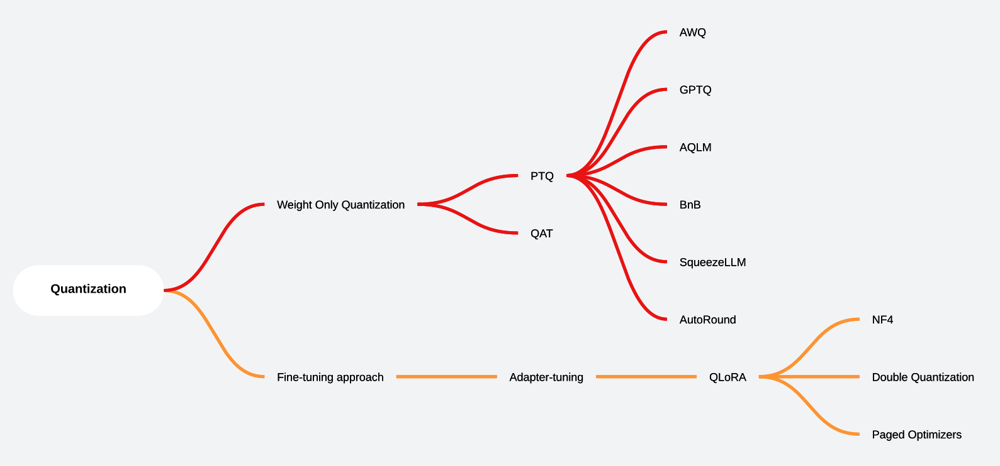

# Overview

> We might agree that the operation of LLMs will embed in daily programming in the future. So, we use these notebooks to familiarize ourselves with the LLMs tools ecosystem and quantization techniques. I believe that Cloud quantum computing is needed for the future of LLMs. Maybe somthing Qubernetes.

All these notebooks have been completed running on the [Kaggle](https://www.kaggle.com/aisuko/code) platform. With the free GPUs. Some of the notebooks use a single GPU P100, some of notebooks use double GPU T4x2, others use CPUs.

> Note: Some of the large size notebooks like [Topic Modeling with BERTopic](nlp/sentence-similarity/clustering/topic-modeling-with-bertopic.ipynb) may not be able to show the complete version on the preview of Github. You can open it in the Kaggle platform by clicking the link in the notebook's title.

# This project is interested in

I want to use of deep neural networks to do GenAI on consumer-grade hardware for researching.

# The ML tasks are covered in this project

This project's notebooks are covering the following some of the following tasks:

# The LLMs are used in this project

The some of LLMs are used in this project are as follows:

# Metrics of fine-tuning

> Note: All the fine-tuning here is under the limited computing resource, so the metrics are not the best. Most of reasons are `num_train_epochs` is not enough. However, the fine-tuning process is the same as the normal process.

And you can check the metrics of the fine-tuning in [wandb.ai](https://wandb.ai/causal_language_trainer?shareProfileType=copy). It includes many of useful metrics, like: training, evaling, system power usage, like below:

# LLMs tools are used in this project

The tools we covered in this project are as follows:

# Quantization techniques are used in this project

The quantization techniques we used in this project are as follows:

# The Concepts From Papers We Should Know

# License

Licensed under the Apache License, Version 2.0 (the "License"); you may not use this file except in compliance with the License. See the [LICENSE](LICENSE) file for details. 

# Credits

Many of the notebooks are based on articles on Medium, TheNewStack, Huggingface and other open-source projects etc. Thanks for these great works.
