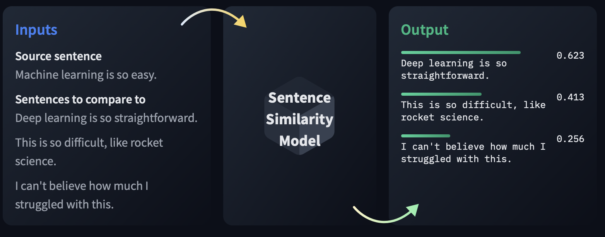

# Overview

Sentence Similarity is the task of determining how similar two texts are. Sentence similarity models convert input text into vectors(embeddings) that capture semantic information and calculate how close(similar) they are between them. This task is particularly useful for information retrieval and clustering/grouping.

# Use Cases(Information Retrival)

We can extract information from documation from documents using Sentence Similarity models. The first step is to rank documents using Passage Ranking models. We can then get to the top ranked document and search it with Sentence Similarity models by selecting the sentence that has the most similarity to the input query.

We will use the Sentence Transformers library to calculate embeddings of sentences, paragraphs, and entire documents. An embedding is just a vector representation of a text and it useful for finding how similar two texts are.

# Usage

## Passage Ranking

Passage Ranking is the task of ranking documents based on their relevance to a given query. The task is evaluated on Mean Reciprocal Rank. These models take one query and multiple documents and return ranked documents according to the relevancy to the query.

## Semantic Textual Similarity 

Semantic Textual Similarity is the task of evaluating how similar two texts are in terms of meaning. These models take a source and a list of sentences in which we wil look for similarities and will return a list of similarity scores.

## Semantic Search

Semantic search seeks to improve search accuracy by understanding the context of the search query. In contrast to traditional search engines which only find documents bases on lexical matches, semantic search can also find synonyms. Below are the different use-cases of semantic search:

* Similar Questions Retrieval
* Similar Publication Retrieval
* Question & Answering Retrieval
